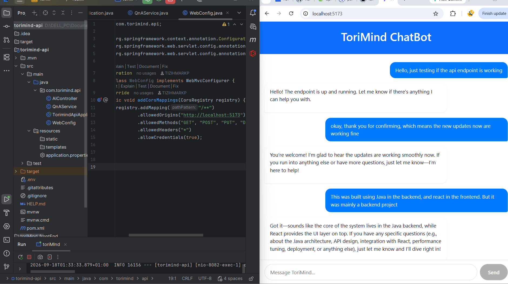
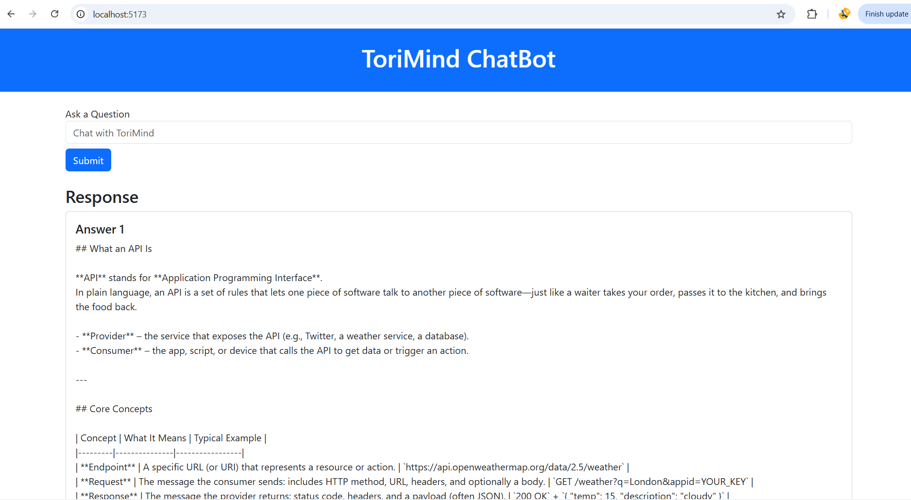
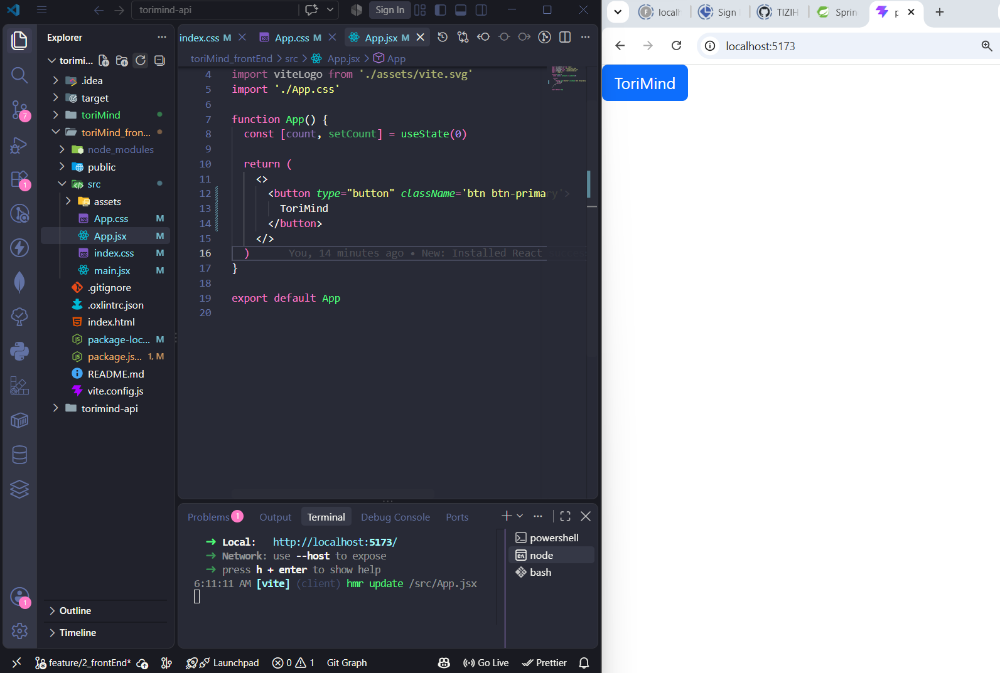
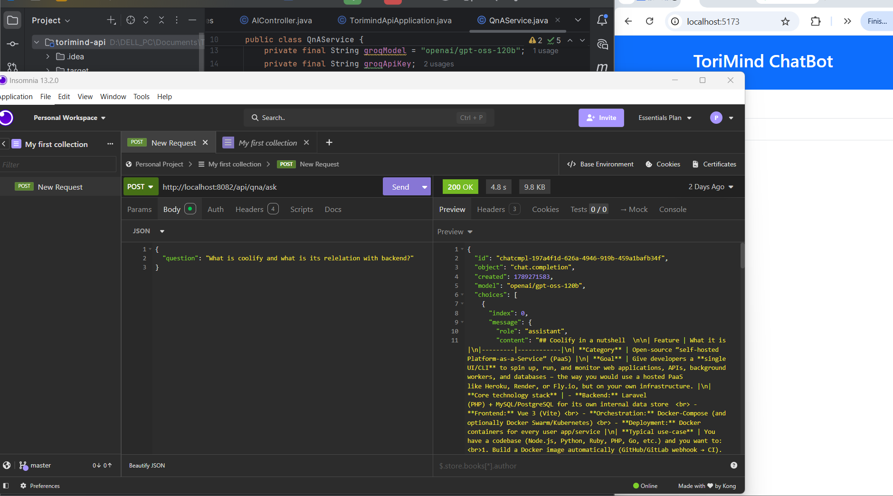
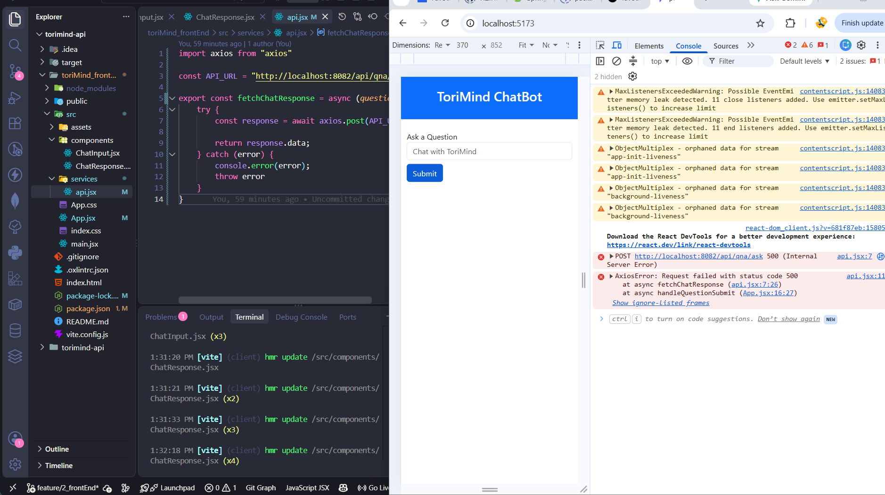

# ToriMind ChatBot 🤖

> A full-stack AI chatbot built with Spring Boot and React, powered by the Groq API

---

## 1. Introduction

This project started as a way for me to level up my backend skills. I had already worked with JavaScript and Python, but I wanted to understand what it actually feels like to build and ship a production style Java application. I picked up a new project and decided to use two different programming languages framework: Spring Boot (Java) for backend and react (Javascript) for frontEnd

ToriMind is the result of that journey. It is a conversational chatbot that takes a question from the user, sends it to a large language model, and streams the answer back into a clean chat interface. Every part of the stack was built from scratch: the Spring Boot backend, the React frontend, the API integration, the error handling, the CORS setup, and the branching workflow

While building it, I learned that your plans may not go as you wanted it to be. Models get deprecated, API formats change, environment variables behave differently across IDEs, and a single missing letter in a JSON property can silently break an entire feature. This project is as much about the bugs I fixed as it is about the chatbot that came out of it

---

## 2. About the Project

ToriMind is a REST-based chatbot application that connects a React frontend to an LLM API through a Spring Boot backend.

The backend is a Spring Boot 4.1.1 application running on Java 21. It exposes a single endpoint, `POST /api/qna/ask`, which accepts a question and returns the model's response in JSON. The request to the language model is made using Spring's `WebClient`, and the Groq API is used as the LLM provider with the `openai/gpt-oss-120b` model

The frontend is a React application built with Vite. It renders a chat interface where users type questions, see their own messages appear as blue bubbles on the right, and receive the AI's answer as white bubbles on the left. Responses are rendered as Markdown, so tables, headings, code blocks, and bold text all display properly

The two halves talk to each other over HTTP with CORS configured to allow local development

---

## 3. Functionalities of the Project

- **Chat interface** – Users can type a question and receive a response in a conversational layout
- **LLM integration** – Powered by the Groq API using the `openai/gpt-oss-120b` model
- **Markdown rendering** – AI responses render as real headings, tables, lists, and code blocks instead of raw symbols
- **Auto-scroll** – New messages scroll into view automatically
- **Enter to send** – The user can press Enter instead of clicking Send
- **Typing indicator** – An animated bubble shows while the AI is thinking
- **Disabled input during loading** – Prevents duplicate requests while a response is in flight
- **Separation of concerns** – Backend and frontend live in separate folders and communicate only through HTTP
- **Environment-based secrets** – The Groq API key is injected through an environment variable and never committed to source control

---

## 4. Screenshots

### The Chat Interface

### Development Process 1 (1st Chatbot Response on UI)

### Development Process 2 (UI)

### Backend Post Request

### Debugging And Fixing Errors

---

## 5. Challenges Encountered During the Project

This project was not a smooth one. I had different challenges along the way and each challenge thought me something I would not have learned if i did not embark on the project

**Configuring environment variables in IntelliJ Community Edition.** Configuring environment variables in IntelliJ Community Edition was not easy. I spent hours trying to make `.env` files work with `spring.config.import`, tried the EnvFile plugin, tried hardcoding temporarily just to prove the code worked, and eventually settled on setting the API key through the Run Configuration environment variables. This was the single most frustrating part of the project

**Spring Boot 4.x changing how WebClient is provided.** In older version of Spring Boot where `WebClient.Builder` was auto-configured by the WebFlux starter, this was not possible in Spring Boot 4.1.1, this behavior changed, and I had to add `spring-boot-starter-webclient` explicitly to make the bean available. The error message ("No qualifying bean of type WebClient$Builder") was not obvious about what to add

**Model deprecation across multiple providers.** My main plan was to make use of Gemini. The Gemini model I tried had been deprecated by the time I tried it, and every request returned a 404. I switched to xAI's Grok API, only to find that the model name I was using had also been retired. I finally moved to Groq, where the first model I picked had also been shut down two weeks earlier. I had to query the `/models` endpoint directly to find a working model, and eventually landed on `openai/gpt-oss-120b`

**A silent typo in the frontend.** After everything finally worked on the backend, the frontend kept showing "No response" with no error in the console. The cause was a single letter: I had written `choice` instead of `choices` when reading the API response. JavaScript's optional chaining silently returned `undefined`, and the `||` fallback kicked in. This one taught me to always verify the actual API response shape in the browser's Network tab instead of trusting the code

**Maven dependency resolution failures.** Early on, Maven could not reach `repo.maven.apache.org` due to a DNS issue on my machine. I had to force a fresh download with `-U`, clear the cached failure from the local repository, and retry. It was a network problem, not a code problem, but it looked like one

Each of these was painful in the moment, but together they taught me more about debugging, environment configuration, and API integration

---

## 6. Future Plans of the Project

- **Persist chat history** – Store conversations in PostgreSQL so the user can revisit past chats
- **Streaming responses** – Stream tokens from the LLM to the frontend so answers appear word by word instead of all at once
- **Multiple chat sessions** – Allow the user to start new conversations and switch between them from a sidebar
- **User authentication** – Add login so chats are tied to individual accounts or users
- **Deployment** – Deploy the backend on Render or Railway and the frontend on Vercel, then link the live demo from this README
- **Model selector** – Let the user choose between different Groq models (fast vs. powerful) from a dropdown
- **Docker support** – Package both the backend and frontend into Docker containers for consistent deployment

---

## 7. Branching Strategy of the Project

This project follows a simple feature/branch workflow with a `develop` integration branch and a stable `main` branch
main
└── develop
├── feature/1_qnaEndpoint
├── feature/2_frontEnd
└── feature/3_betterUIUX

- **`main`** - The stable, production ready branch. Only merged into when a feature is complete and tested
- **`develop`** - The integration branch where features are merged before being promoted to `main`
- **`feature/1_qnaEndpoint`** - The initial Spring Boot backend work, including the `QnAService` and the `POST /api/qna/ask` endpoint
- **`feature/2_frontEnd`** - The React frontend, including the chat interface, API service layer, and CORS configuration
- **`feature/3_betterUIUX`** - The chat layout upgrade with fixed input bar, message bubbles, Markdown rendering, typing indicator, and auto scroll

Each feature branch is merged into `develop` once it works, and `develop` is merged into `main` when a milestone is reached. This keeps `main` clean and lets me experiment freely on feature branches without breaking anything

---

## Tech Stack

| Layer | Technology |
|-------|-----------|
| Backend | Java 21, Spring Boot 4.1.1, Spring WebClient, Maven |
| Frontend | React 19, Vite, Axios, React-Markdown, remark-gfm |
| LLM Provider | Groq API (`openai/gpt-oss-120b`) |
| Styling | Custom CSS + Boostrap |

---

## Getting Started

### Backend

1. Clone the repository
2. Create a Groq API key at `console.groq.com/keys`
3. In IntelliJ, set the environment variable `GROQ_API_KEY` in your Run Configuration
4. Run `TorimindApiApplication`. The backend starts on port `8082`

### Frontend

1. Navigate to the frontend folder
2. Run `npm install`
3. Run `npm run dev`. The app opens on `http://localhost:5173`

---

## Author

Built by **Tizih Mark-PrinceWill** as a self driven learning project during my internship season

If you found this project interesting, please give it a star ⭐ and feel free to reach out or fork it

---
`Last Update: 18/09/2026`